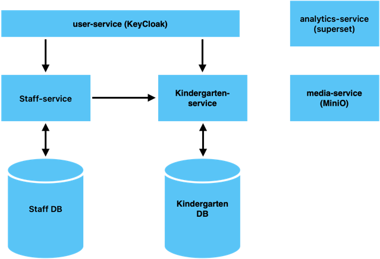

# Kindergarten Platform — Структура проекта

**Информационная система для управления детским садом**

---

## Содержание

1. Краткое описание архитектуры
2. Микросервисы и их ответственность
3. Модели данных (ключевые сущности)
4. Взаимодействие сервисов (последовательности и интеграция)
5. API — примеры контрактов
6. Схема базы данных (текстовая диаграмма)
7. Docker Compose — скелет для локальной разработки
8. CI/CD — основные шаги в GitLab CI
9. План задач для первого спринта
10. Используемые технологии

---

## 1. Краткое описание архитектуры

Система построена на микросервисной архитектуре и включает как доменные сервисы, так и вспомогательные:

* Каждый сервис — отдельное Spring Boot приложение (Java 17 / Jmix) со своей базой данных (PostgreSQL).
* Авторизация и аутентификация пользователей — через Keycloak.
* Хранение медиафайлов (фотографии детей и сотрудников) — MinIO.
* Аналитика — Apache Superset, подключаемый к агрегационной базе данных или материализованным представлениям.
* Инфраструктура для локальной среды — Docker и Docker Compose.
* CI/CD конвейер реализуется средствами GitLab CI.

---

## 2. Cервисы и их ответственность

    KindergartenPlatform/ 
    ├─ analytics-service/ 
    ├─ kindergarten-service/ 
    ├─ kindergarten-service-db/ 
    ├─ media-service/ 
    ├─ staff-service/ 
    ├─ staff-service-db/ 
    └─ user-service/

### 2.1 `user-service` — пользователи и интеграция с Keycloak
[Настройка и запуск](user-service/README.MD)
* Регистрация и синхронизация пользователей (администраторы, воспитатели, родители).
* Управление профилями.
* Взаимодействие с Keycloak (provisioning, mappers).
* Keycloak — точка аутентификации и авторизации.

### 2.2 `staff-service` — сотрудники
[Настройка и запуск](staff-service/README.MD)
* CRUD-операции с сотрудниками (воспитатели, няни, повара и др.).
* Ссылки на фотографии, хранящиеся в MinIO.
* График работы, квалификация, контактная информация.
* REST API для других сервисов.

### 2.3 `kindergarten-service` — группы, дети, посещаемость

* Управление группами: название, возрастная категория, расписание, закреплённые воспитатели.
* Управление детьми: профили (ФИО, дата рождения, родители, медицинские данные).
* Учёт посещаемости: отметка прихода/ухода, статус посещения.
* Фото детей (MinIO).
* Интеграция со `staff-service` (сотрудники) и `user-service` (родители).

### 2.4 `notifications-service` — уведомления

* Отправка сообщений (email, push, webhooks).
* Управление подписками и шаблонами уведомлений.

### 2.5 `analytics-service` — аналитика

* Агрегация данных в отдельной базе или через материализованные представления.
* Apache Superset для построения отчётов и дашбордов.

### 2.6 `media-service` (опционально) — медиа
[Настройка и запуск](media-service/README.MD)

* Прокси-доступ к MinIO.
* Загрузка и выдача файлов с управлением доступом.
* Генерация подписанных ссылок.

---

## 10. Используемые технологии

* **Java 17**
* **Jmix**
* **Spring Boot**
* **REST API**
* **OpenAPI (Swagger)**
* **PostgreSQL**
* **MinIO**
* **Keycloak**
* **Apache Superset**
* **Docker**
* **Docker Compose**
* **GitLab CI/CD**
* **Gradle**
* **Liquibase**

